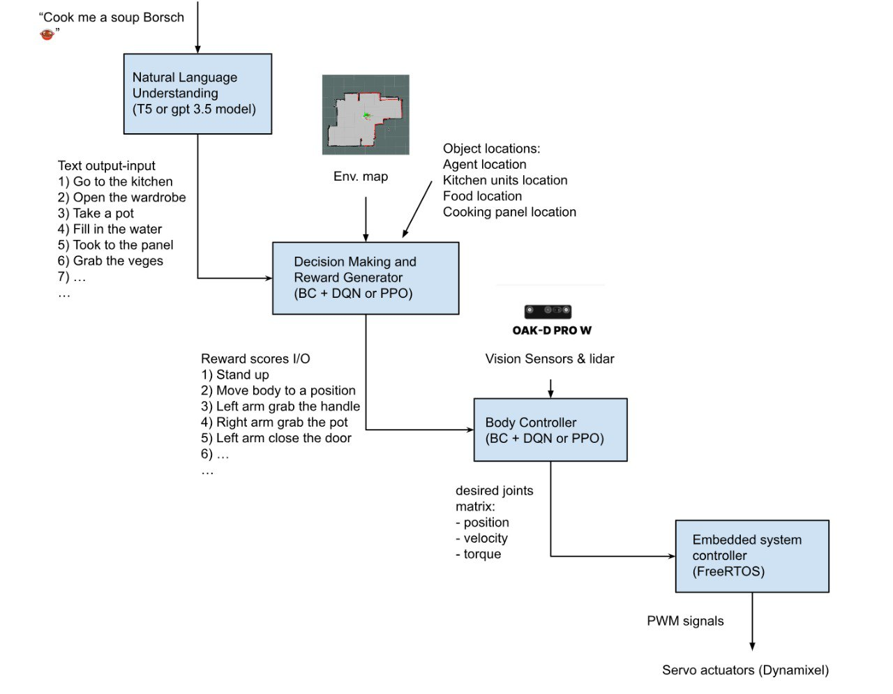

Most systems are based on deep neural networks that perform specific tasks like computer vision, computer hearing, natural language processing, and image generation. The broader tasks like making a dish or tidying the apartment are still really challenging for ML systems. Humans are still exploring new methods to create and mimic the human brain.
What fascinates me is watching children learning to walk. Achieving bipedal walking is incredibly complex and almost impossible using traditional inverse kinematic approaches.
In recent times, the technology known as "reinforcement learning" has been evolving at a rapid pace. This technology is closely related with the philosophy of the brain and mind, but it is one of the hardest methods to implement in real applications, even for experienced programmers. 

The project architecture:

